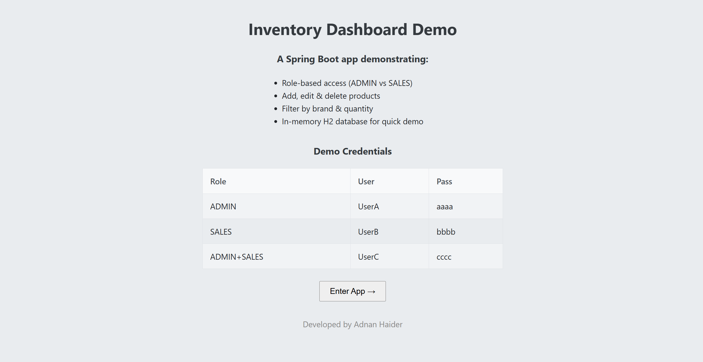
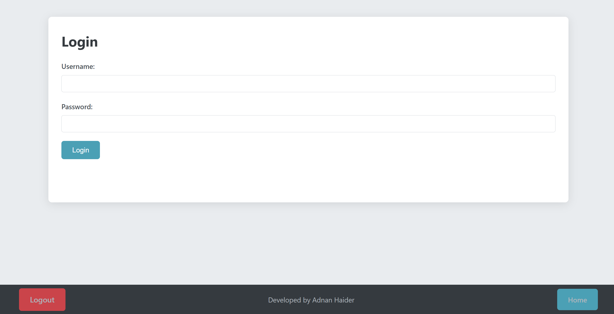
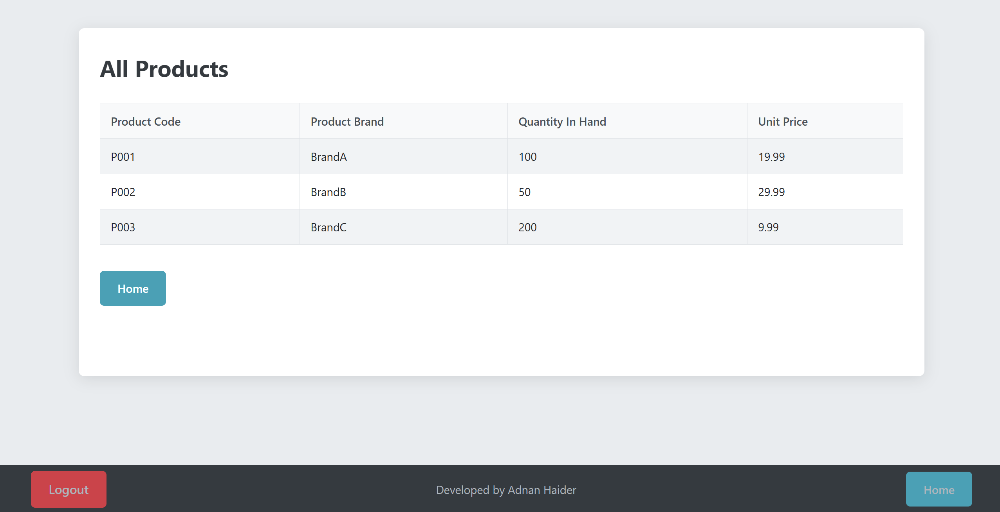

# Product Catalog Manager

[](https://your-domain.com/product-catalog-manager)

🔗 **Live Demo:** https://your-domain.com/product-catalog-manager  
📂 **Source Code:** https://github.com/yourusername/product-catalog-manager

---

## Table of Contents

- [Screenshots](#screenshots)
- [About](#about)
- [Demo Credentials](#demo-credentials)
- [Key Features](#key-features)
- [Tech Stack](#tech-stack)
- [Getting Started](#getting-started)
  - [Prerequisites](#prerequisites)
  - [Installation](#installation)
  - [Running the App](#running-the-app)
  - [Accessing the App](#accessing-the-app)
- [Project Structure](#project-structure)
- [Configuration](#configuration)
- [Database](#database)
- [Security](#security)
- [Future Enhancements](#future-enhancements)
- [Contributing](#contributing)
- [Author](#author)

---

## Screenshots

### Landing Page

{ width=600px }

### Login Page

{ width=600px }

### Product List

{ width=600px }

---

## About

**Product Catalog Manager** is a Spring Boot web application that demonstrates:

- Role-based access control (ADMIN vs SALES)
- CRUD operations on a product catalog
- Filtering by brand and quantity threshold
- An in-memory H2 database pre-loaded with sample data
- Form-based login and custom access-denied handling

Polished from a college Enterprise Java project for portfolio showcase.

---

## Demo Credentials

| Role            | Username | Password |
| --------------- | -------- | -------- |
| **ADMIN**       | UserA    | aaaa     |
| **SALES**       | UserB    | bbbb     |
| **ADMIN+SALES** | UserC    | cccc     |

> **Tip:** Visit the [Live Demo](https://your-domain.com/product-catalog-manager/) landing page to “Enter App” and view credentials.

---

## Key Features

- 🔐 **Role-Based Security**: ADMIN can add/edit/delete; SALES can view and filter
- 📦 **Product Management**: intuitive forms for creating, updating, deleting
- 🔍 **Filtering**: search products by brand or stock quantity
- ⚡ **H2 In-Memory**: instant demo data, no external database setup
- 🛠 **Thymeleaf UI**: clean templates with responsive styling
- 🚫 **Access Denied Page**: custom feedback for unauthorized attempts

---

## Tech Stack

- **Language & Framework**: Java 17, Spring Boot 3
- **Security**: Spring Security, Thymeleaf Extras
- **View Layer**: Thymeleaf, HTML5, CSS3
- **Database**: H2 (in-memory, demo mode)
- **Build & Dependency Management**: Maven Wrapper (`./mvnw`)
- **Optional**: Docker, GitHub Actions CI, one-click deploy on Render/Railway

---

## Getting Started

### Prerequisites

- **Java 17** JDK installed ([Adoptium](https://adoptium.net/))
- **Maven Wrapper** included—no global Maven install needed
- (Optional) **Git** for cloning the repo

### Installation

1. Clone the repository

   ```bash
   git clone https://github.com/yourusername/product-catalog-manager.git
   cd product-catalog-manager
   ```

2. (macOS/Linux) Make the Maven wrapper executable
   ```bash
   chmod +x mvnw
   ```

### Running the App

- **Linux/macOS**

  ```bash
  ./mvnw spring-boot:run
  ```

- **Windows**
  ```bash
  mvnw.cmd spring-boot:run
  ```

### Accessing the App

1. Open your browser at http://localhost:8080/
2. Review the landing page for features and credentials
3. Click Enter App → to reach the login screen
4. Log in with one of the demo users above

---

## Project Structure

```text
product-catalog-manager/
├── .mvn/
│   └── wrapper/…
├── mvnw*
├── mvnw.cmd*
├── pom.xml
├── HELP.md
├── README.md
├── .gitignore
├── .gitattributes
├── src/
│   ├── main/
│   │   ├── java/
│   │   │   └── ca/sheridan/golamhai/
│   │   │       ├── controller/
│   │   │       │   ├── HomeController.java
│   │   │       │   └── ProductController.java
│   │   │       ├── dao/
│   │   │       │   └── ProductsDatabaseAccess.java
│   │   │       ├── model/
│   │   │       │   └── Product.java
│   │   │       └── security/
│   │   │           └── ProductSecurityConfig.java
│   │   └── resources/
│   │       ├── keystore/
│   │       │   └── MyKeystore.p12
│   │       ├── static/
│   │       │   └── css/
│   │       │       └── main.css
│   │       ├── templates/
│   │       │   ├── AddProduct/…        # productDataInput, confirm, etc.
│   │       │   ├── EditProduct/…       # edit list, update, delete confirm
│   │       │   ├── fragments/
│   │       │   │   └── footer.html
│   │       │   ├── ListProducts/…      # listOfProducts, byBrand, byQuantity
│   │       │   ├── landing.html
│   │       │   ├── login.html
│   │       │   ├── logout.html
│   │       │   └── accessDenied.html
│   │       ├── application.properties
│   │       ├── data.sql
│   │       └── schema.sql
│   └── test/
└── target/
```

## Configuration

- application-dev.properties
  ```bash
  server.port=8080
  server.ssl.enabled=false
  spring.h2.console.enabled=true
  ```
- application-prod.properties
  ```bash
  server.port=${PORT:8080}
  server.ssl.enabled=false
  spring.h2.console.enabled=false
  ```

## Database

- H2 in-memory database
- Schema & seed data in schema.sql & data.sql under resources
- H2 Console (dev only): http://localhost:8080/h2-console

## Security

- In-memory users configured in ProductSecurityConfig.java
- Roles: ADMIN, SALES
- Custom login page at /login and access-denied page at /accessDenied

## Future Enhancements

- Migrate H2 → PostgreSQL with Flyway migrations
- Add JWT-secured REST API and Swagger/OpenAPI docs
- Increase test coverage (unit & integration tests)
- Implement GitHub Actions CI/CD → Render deploy
- Provide Docker + docker-compose.yml for turnkey setup

## Contributing

1. Fork the repo
2. Create a branch (git checkout -b feature/XYZ)
3. Commit changes (git commit -m "Add XYZ")
4. Push to GitHub (git push origin feature/XYZ)
5. Open a Pull Request

---

> **Built & maintained by [Adnan Haider](https://www.linkedin.com/in/adnan-haider-dev/)**
